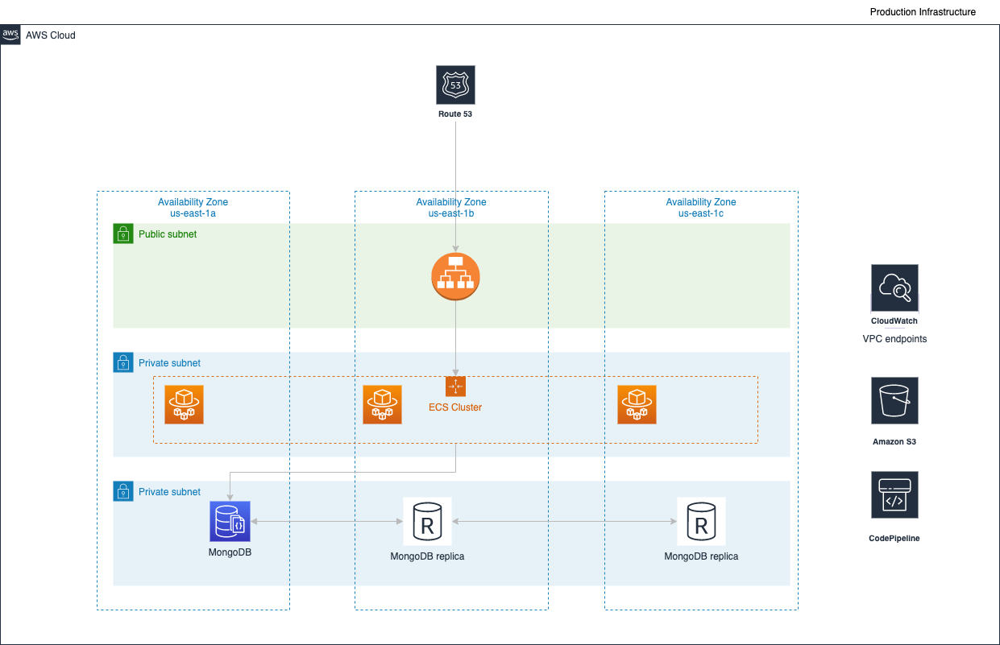

# Cloud Phoenix Kata infrastructure ![version][version-badge]
[version-badge]: https://img.shields.io/badge/version-1.0-blue.svg

## Components
- VPC
- ECS
- CodePipeline
- ALB
- Route53
- CloudWatch

### Repos:
- infrastructure: code to build the infra
- app code: the application code, and conf files to build the app

### Initial setup

### How to use sops
##### Generate secrets

### How a release works

### Who to contact
